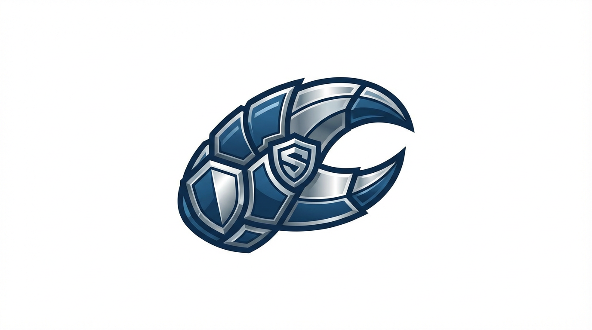

<p align="center">
  
</p>

<p align="center">
  Security-hardened fork of <a href="https://github.com/qwibitai/NanoClaw">NanoClaw</a>. Container isolation + 3-layer defense-in-depth.
</p>

<p align="center">
  <a href="https://github.com/airobotlab/safeclaw">GitHub</a>&nbsp; • &nbsp;
  <a href="https://github.com/qwibitai/NanoClaw">Upstream NanoClaw</a>
</p>

## OpenClaw vs SafeClaw

| | OpenClaw | SafeClaw |
|---|---|---|
| **Philosophy** | Maximize agent reach | Restrict agent reach at OS level, control code changes |
| **Codebase** | ~400K lines, 45+ deps | ~500 lines core, 35K tokens total |
| **Integrations** | 50+ built-in, 700+ community skills | WhatsApp only (add more via skills) |
| **LLM support** | Multi-LLM | Anthropic Claude Agent SDK only |
| **Isolation** | Application-level (allowlists, pairing codes) | OS-level container per group + 3 security layers |
| **Runtime** | Single Node process, shared memory | Host orchestrator + isolated Linux containers |
| **Auditability** | Practically impossible (400K lines) | Full audit in ~8 minutes |

## Why This Exists

OpenClaw is impressive — 50+ integrations, hundreds of community skills, multi-LLM support. But all of that runs in **one Node process with shared memory**, and security is enforced at the application level (allowlists, pairing codes). This creates structural problems:

| Threat | OpenClaw | Why it's a problem |
|--------|----------|-------------------|
| **Host filesystem destruction** | Agent runs directly on host | A bad command or malicious skill can delete system files or format disk |
| **Unauthorized email/message sending** | 50+ integrations always connected | With Gmail installed, a malicious skill can silently send emails |
| **Unlimited data exfiltration** | No network restrictions | Agent can send any accessible data to any external server |
| **Unauditable codebase** | 400K lines + 700+ community skills | Nobody actually reviews everything. The open-source trust assumption breaks down |
| **No privilege isolation** | Application-level security only | Bypassable. One breach exposes all connected integrations |

SafeClaw takes the opposite approach: **minimize the attack surface, isolate at the OS level, and verify every change.**

## SafeClaw Security Architecture

### Existing NanoClaw Protections (Container Isolation)

NanoClaw already provides strong baseline security:

- **Per-group isolated containers** — macOS: Apple Container/VM, Linux: Docker
- **Explicit mount only** — only mounted directories are accessible; host filesystem is invisible
- **Root escape proof** — even with root inside the container, host is unreachable
- **No implicit integrations** — Gmail doesn't exist unless you install it; no email sending without the skill
- **Auditable in 8 minutes** — 500 lines of core logic, fully reviewable

### What Was Missing

| Gap | Risk |
|-----|------|
| **No skill trust verification** | Skill files are markdown instructions — malicious directives hidden in natural language can't be caught by static analysis |
| **Code changes applied without approval** | Claude Code modifies source based on skills with no user confirmation — if the code gets poisoned, the container faithfully executes malicious behavior |
| **No network restriction** | Containers have full outbound internet access — if the above two are breached, data can flow to any external server |

### The 3 Security Layers SafeClaw Adds

#### Layer 1: Skill File LLM Pre-Review

On startup, a separate LLM call reviews every skill markdown file for:

- Instructions to exfiltrate data to external servers/URLs
- Credential or secret file access patterns
- Obfuscated commands or encoded payloads (base64, hex, etc.)
- Container escape or host modification instructions
- Hidden instructions in comments or invisible characters

Results are **cached by SHA256 file hash** — unchanged skills skip review. If any skill fails, it is **not synced** to containers.

```
[startup] Reviewing skill file with LLM...
[startup] All skill files passed LLM security review
```

Not perfect, but catches blatant malicious instructions as a first gate.

#### Layer 2: Code Change Diff Approval (The Key Layer)

When applying a skill via the skills-engine, **all changes are shown as a diff before they take effect**:

```
╔══════════════════════════════════════════╗
║  SECURITY: Code change review required   ║
╚══════════════════════════════════════════╝

Skill "add-telegram" will make the following changes:

  [NEW FILES]
    + src/channels/telegram.ts

  [MODIFIED FILES]
    ~ src/index.ts
      +import { TelegramChannel } from './channels/telegram.js';
      ...

  [NPM DEPENDENCIES]
    + telegraf: ^4.16.0

  [POST-APPLY COMMANDS]
    $ npm run build

Apply these changes? (yes/no):
```

The user must type `yes`. Reject → automatic rollback.

This is the most critical layer: **no matter what a skill instructs, the final code change must pass human review.** A malicious skill that tries to sneak in Gmail exfiltration code will be visible in the diff.

Set `NANOCLAW_SKIP_DIFF_APPROVAL=1` for CI/automation.

#### Layer 3: Container Network Egress Whitelist

Containers can **only connect to whitelisted domains**. Enforced via iptables inside the container — the entrypoint runs as root to configure the firewall, then drops to the `node` user.

Default allowed:
- `api.anthropic.com` — Claude API calls
- `cdn.anthropic.com` — SDK resources
- `sentry.io` — error reporting
- `statsig.anthropic.com` — feature flags

Everything else is **DROP**ped. Even if layers 1 and 2 are breached, data cannot reach unknown external servers.

Config at `~/.config/nanoclaw/network-allowlist.json`:

```json
{
  "enabled": true,
  "allowed_domains": [
    "api.anthropic.com",
    "cdn.anthropic.com",
    "sentry.io",
    "statsig.anthropic.com"
  ]
}
```

## Threat Comparison

| Threat | OpenClaw | SafeClaw |
|--------|----------|------------|
| Host file deletion/format | **Possible** (runs on host) | **Impossible** (container isolation) |
| Silent email/message sending | **Possible** (50+ integrations always connected) | **Impossible** without skill install + **diff approval required** |
| Malicious skill injection | **Hard to detect** (400K line codebase) | **Layer 1** LLM review + **Layer 2** diff approval |
| Data exfiltration | **No restriction** | **Layer 3** network whitelist blocks unknown destinations |
| Full code audit | **Practically impossible** | 500 lines, **8 minutes** |

## Irreducible Threats

These exist in **any** agent framework and are not solvable at the NanoClaw level:

| Threat | Why it's irreducible |
|--------|---------------------|
| API key must exist | Agent needs it to function |
| Mounted directories are exposed | Agent must read/write files to be useful |
| Host orchestrator runs outside container | Container management requires host access; this is OS security territory |
| Claude Agent SDK trust | If you don't trust the SDK, there's no reason to use the framework |

## Combined Defense

For an attack to succeed against SafeClaw, it must simultaneously:

1. **Fool the LLM review** — craft a skill that passes automated security audit
2. **Fool the human reviewer** — hide malicious code in a diff that gets approved
3. **Exfiltrate via whitelisted domains only** — no arbitrary outbound connections

All three conditions at once is practically infeasible.

## What Changed (vs upstream NanoClaw)

| File | Change |
|------|--------|
| `src/skill-review.ts` | **New** — LLM skill review engine with SHA256 caching |
| `src/network-policy.ts` | **New** — Network allowlist management and DNS resolution |
| `container/entrypoint.sh` | **New** — iptables firewall setup + privilege drop |
| `src/container-runner.ts` | Skill review gate, async network args, `HOST_UID`/`HOST_GID` env mapping |
| `src/index.ts` | Startup calls for skill review and network allowlist init |
| `skills-engine/apply.ts` | Interactive diff approval step before code changes |
| `container/Dockerfile` | Added `iptables`, external entrypoint, root start for firewall setup |

All original NanoClaw functionality is preserved. Changes are additive only.

## Quick Start

```bash
git clone https://github.com/airobotlab/SafeClaw.git
cd SafeClaw
claude
```

Then run `/setup`. Claude Code handles dependencies, authentication, container build, and service configuration.

After setup, rebuild the container to include the iptables firewall:

```bash
./container/build.sh
```

## Keeping Up with Upstream

This fork merges cleanly with upstream NanoClaw:

```bash
git remote add upstream https://github.com/qwibitai/NanoClaw.git
git fetch upstream
git merge upstream/main
```

The security layers are additive — they wrap existing logic without modifying it.

## Requirements

- macOS or Linux (Windows via WSL2 + Docker Desktop)
- Node.js 20+
- [Claude Code](https://claude.ai/download)
- [Docker](https://docker.com/products/docker-desktop) or [Apple Container](https://github.com/apple/container) (macOS)
- Anthropic API key (also used for Layer 1 skill review)

## Original NanoClaw

For the upstream project, philosophy, architecture, and full documentation:

**[github.com/qwibitai/NanoClaw](https://github.com/qwibitai/NanoClaw)**

## License

MIT
